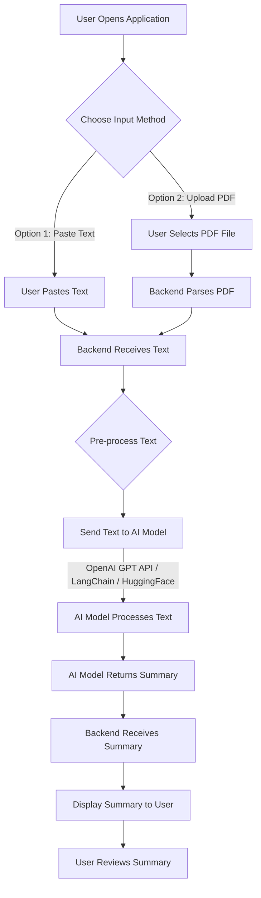

## 🧠 5. Automatic Text Summarization Project: Development Plan

This plan outlines the steps to build a functional Automatic Text Summarization tool, based on the previous description. We'll create a simple web application where users can input text or upload a PDF, and then get a concise summary powered by a pre-trained AI model.

-----
Chắc chắn rồi\! Dưới đây là bản chỉnh sửa toàn bộ bài viết dự án, tập trung vào cách trình bày rõ ràng, mạch lạc và chuyên nghiệp hơn, kèm theo các biểu tượng và cấu trúc theo yêu cầu của bạn:

-----

## 🧠 5. Automatic Text Summarization Project

### Overview

This project aims to develop a user-friendly application that leverages **artificial intelligence** to automatically summarize long texts or PDF documents. Users will be able to either paste text directly into the application or upload a PDF file. The core functionality will be powered by advanced AI models, providing **concise and easy-to-understand summaries**. This tool is designed to significantly enhance productivity by quickly extracting key information from lengthy documents.

-----

### ✨ Key Features

  * **Text Input**: Users can directly paste or type long text into an input field.
  * **PDF Upload**: Ability to upload PDF files for summarization.
  * **AI-Powered Summarization**: Utilizes **state-of-the-art Natural Language Processing (NLP) models** to generate accurate and relevant summaries.
  * **Concise Output**: Summaries will be short, to the point, and capture the main essence of the original content.
  * **User-Friendly Interface**: An intuitive and clean interface for a seamless user experience.

-----

### 🚀 Overview Steps

1.  **Project Setup & Environment Configuration**:

      * Initialize project repository.
      * Set up virtual environment and install necessary libraries (e.g., `transformers`, `langchain`, `openai`, `pypdf`).
      * Configure API keys for chosen AI service (e.g., OpenAI API key).

2.  **User Interface (UI) Development**:

      * Design and implement the front-end for text input and PDF upload.
      * Create a display area for the generated summary.
      * (Optional) Add a progress indicator for summarization tasks.

3.  **Backend Development & Core Logic**:

      * Implement logic to handle text input and PDF parsing.
      * Integrate with the selected AI summarization library (LangChain, HuggingFace Transformers, or OpenAI GPT API).
      * Develop the summarization function that sends text to the AI model and receives the summary.

4.  **Error Handling & Edge Cases**:

      * Implement robust error handling for API failures, invalid file types, or excessively long inputs.
      * Consider edge cases like very short texts or documents with no discernible content.

5.  **Testing & Refinement**:

      * Conduct thorough testing with various text lengths, topics, and PDF structures.
      * Optimize summarization parameters for better quality and speed.
      * Gather user feedback for UI/UX improvements.

-----

### 🔄 Project Flow

The following flow illustrates the user journey and system interactions:



**Detailed Flow Description:**

1.  **User Opens Application**: The user launches the summarization tool.
2.  **Choose Input Method**: The user decides whether to paste text or upload a PDF.
3.  **User Pastes Text**: If pasting, the user inputs the long text into the provided text area.
4.  **User Selects PDF File**: If uploading, the user selects a PDF file from their local machine.
5.  **Backend Receives Text / Parses PDF**: The backend receives the raw text or initiates the PDF parsing process to extract text content.
6.  **Pre-process Text**: The extracted text undergoes necessary pre-processing (e.g., cleaning, splitting into manageable chunks for API limits).
7.  **Send Text to AI Model**: The pre-processed text is sent to the chosen AI model (OpenAI GPT, a LangChain-orchestrated model, or a HuggingFace Transformer model) via its API.
8.  **AI Model Processes Text**: The AI model performs the summarization task using its advanced NLP capabilities.
9.  **AI Model Returns Summary**: The AI model sends back the generated concise summary.
10. **Backend Receives Summary**: The backend receives the summary from the AI model.
11. **Display Summary to User**: The generated summary is displayed in a dedicated output area on the user interface.
12. **User Reviews Summary**: The user can then review and utilize the summarized content.

-----


### ✨ Core Functionality

  * **Text Input/Output:** Users paste text, receive summary.
  * **PDF Upload/Summarization:** Users upload PDF, extract text, summarize, receive summary.
  * **AI Model Integration:** Using a pre-trained summarization model from Hugging Face.

-----

### 🛠️ Technology Stack

  * **Backend & Core Logic:** Python
  * **Web Framework (for quick UI):** Streamlit
  * **AI Model:** Hugging Face Transformers (`pipeline` for summarization)
  * **PDF Processing:** `PyPDF2`


-----

### 💪 Strengths of this Project

  * **Ease of Understanding**: The concept of automatic text summarization is straightforward and easily grasped by a broad audience.
  * **Practicality**: This tool addresses a real-world need, helping individuals and professionals save time and quickly digest information.
  * **High Relevance (AI for Productivity)**: It directly applies cutting-edge AI technology to solve a common productivity challenge, aligning perfectly with current trends in AI applications.
  * **Scalability**: Depending on the chosen AI service and architecture, the tool can be scaled to handle varying loads and document sizes.


-----

### 🚀 Development Steps & Code Snippets

#### 1\. Project Setup & Environment Configuration

First, create a new directory for your project and set up a virtual environment.

```bash
mkdir text_summarizer_app
cd text_summarizer_app
python -m venv venv
# On Windows:
.\venv\Scripts\activate
# On macOS/Linux:
source venv/bin/activate
```

Next, install the necessary libraries:

```bash
pip install streamlit transformers torch PyPDF2
```

**Note:** `torch` (PyTorch) is a dependency for Hugging Face Transformers. If you face installation issues, refer to the [PyTorch website](https://pytorch.org/get-started/locally/) for specific installation instructions based on your system (especially if you have a GPU). For CPU-only, `pip install torch` usually works.

#### 2\. Create the Streamlit Application File

Create a file named `app.py` in your project directory. This will contain all the Streamlit UI and backend logic for this MVP.

#### 3\. Implement Core Summarization Logic

Inside `app.py`, let's define the summarization function using Hugging Face's `pipeline`.

```python
# app.py

import streamlit as st
from transformers import pipeline
import PyPDF2
import io

# Initialize the summarization pipeline
# Using 'sshleifer/distilbart-cnn-12-6' which is a good general-purpose summarization model.
# This will download the model the first time it runs.
@st.cache_resource
def load_summarizer():
    return pipeline("summarization", model="sshleifer/distilbart-cnn-12-6")

summarizer = load_summarizer()

def summarize_text(text, max_length=150, min_length=30):
    if not text.strip():
        return "No text provided to summarize."
    try:
        # The summarizer often takes a list of texts
        summary = summarizer(text, max_length=max_length, min_length=min_length, do_sample=False)
        return summary[0]['summary_text']
    except Exception as e:
        return f"Error during summarization: {e}"

def extract_text_from_pdf(pdf_file):
    text = ""
    try:
        # PyPDF2 expects a binary file, so use io.BytesIO for uploaded files
        pdf_reader = PyPDF2.PdfReader(io.BytesIO(pdf_file.read()))
        for page_num in range(len(pdf_reader.pages)):
            page = pdf_reader.pages[page_num]
            text += page.extract_text()
        return text
    except Exception as e:
        return f"Error extracting text from PDF: {e}"

```

**Explanation:**

  * `@st.cache_resource`: This decorator tells Streamlit to cache the summarizer model. This means the model will only be downloaded and loaded into memory once, significantly speeding up subsequent runs of the application.
  * `pipeline("summarization", model="sshleifer/distilbart-cnn-12-6")`: This is the magic line from Hugging Face. It sets up a pre-trained model for summarization. The chosen model is `distilbart-cnn-12-6`, which is a good balance between performance and size for general text summarization.
  * `summarize_text`: This function takes the text and optional `max_length`/`min_length` for the summary. It handles potential empty input.
  * `extract_text_from_pdf`: This function uses `PyPDF2` to read a PDF file object (from Streamlit's `st.file_uploader`) and extract all text from its pages.

#### 4\. Build the Streamlit User Interface

Now, let's add the UI elements to `app.py`.

```python
# app.py (continued)

st.set_page_config(page_title="AI Text Summarizer", layout="wide")

st.title("🧠 AI Text Summarizer")
st.markdown("---")

st.subheader("1. Summarize from Text Input")
text_input = st.text_area("Paste your text here:", height=300, help="Enter the long text you want to summarize.")

if st.button("Summarize Text"):
    if text_input:
        with st.spinner("Summarizing... Please wait."):
            summary = summarize_text(text_input)
            st.success("Summary from Text:")
            st.write(summary)
    else:
        st.warning("Please paste some text to summarize.")

st.markdown("---")

st.subheader("2. Summarize from PDF Upload")
pdf_file = st.file_uploader("Upload a PDF file:", type=["pdf"], help="Upload a PDF document to get its summary.")

if pdf_file:
    with st.spinner("Extracting text from PDF and summarizing..."):
        extracted_text = extract_text_from_pdf(pdf_file)
        if "Error" in extracted_text:
            st.error(extracted_text) # Display PDF extraction error
        elif extracted_text.strip():
            summary = summarize_text(extracted_text)
            st.success("Summary from PDF:")
            st.write(summary)
            # Optionally show extracted text for debugging/transparency
            # with st.expander("View Extracted Text from PDF"):
            #     st.text(extracted_text[:1000] + "..." if len(extracted_text) > 1000 else extracted_text)
        else:
            st.warning("Could not extract any meaningful text from the PDF.")
else:
    st.info("Upload a PDF file above to get its summary.")

st.markdown("---")
st.caption("Powered by Hugging Face Transformers & Streamlit")

```

**Explanation:**

  * `st.set_page_config`: Configures the browser tab title and page layout.
  * `st.title`, `st.subheader`, `st.markdown`: Used for structuring the content with titles and separators.
  * `st.text_area`: Provides a multi-line input box for users to paste text.
  * `st.button`: Triggers the summarization process for text input.
  * `st.file_uploader`: Allows users to upload PDF files.
  * `st.spinner`: Shows a loading indicator while the summarization is in progress.
  * `st.success`, `st.warning`, `st.error`, `st.info`: Display various types of messages to the user.
  * `st.write`: Displays the resulting summary.

#### 5\. Run the Application

Save the `app.py` file. Then, open your terminal (make sure your virtual environment is activated) and run:

```bash
streamlit run app.py
```

This command will open a new tab in your web browser, pointing to your Streamlit application. The first time you run it, it will download the `distilbart-cnn-12-6` model, which might take a few minutes depending on your internet connection.

-----

### 🧠 Project Summary (What you've built)

You've successfully set up an MVP of your **Automatic Text Summarization** project\!

  * **User Interface:** A simple web interface using Streamlit, allowing users to input text or upload PDF files.
  * **Text Processing:** The ability to extract text from PDF documents.
  * **AI Summarization:** Integration with a powerful pre-trained summarization model from Hugging Face Transformers.
  * **Error Handling:** Basic handling for empty inputs and PDF extraction issues.

This setup is a fantastic starting point. From here, you can explore adding more features like:

  * **Summary Length Control:** Sliders for users to specify desired summary length more precisely.
  * **Multiple Summarization Models:** Offer choices between different models (e.g., more extractive vs. abstractive).
  * **OpenAI GPT Integration:** If you have an OpenAI API key, you could swap out the Hugging Face model for GPT for potentially higher quality summaries (requires `pip install openai` and managing API keys).
  * **Download Summary:** Option to download the summary as a text file.
  * **User Authentication:** For more complex applications or private use cases.
